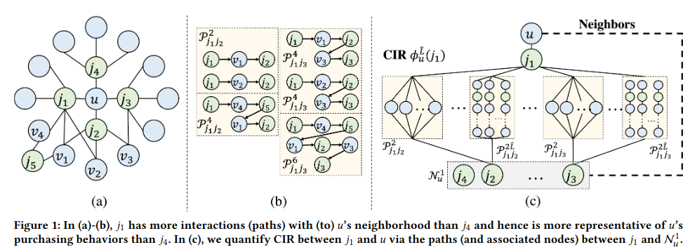

# CAGCN
This repository is an official PyTorch(Geometric) implementation of CAGCN (also includes the baseline implementation of MF/NGCF/LightGCN) in ["Collaboration-Aware Graph Convolutional Networks for
Recommendation Systems"](https://arxiv.org/abs/2207.06221).

We have two experimental settings based on how we split the data:
* Paper setting: this setting is used in most previous literature (LightGCN, NGCF....), which is also used in our CAGCN paper. Note here the training/testing edges are randomly splitted and hence not following the time information. We may end up with using future edges to predict history edges. See [[Paper_setting]](./Paper_setting/.) for more details.

* Realistic setting: after notice the above issue, we recollect the three datasets gowalla/yelp/amazon and split them strictly according to time. We also provide the code for preprocessing the datasets and the readers can modify it based on your own needs. See [[Realistic_setting]](./Realistic_setting/.) for more details.

* Node Classification: based on the reviewers' suggestion, we further incorporate our Collaboration-aware Graph Convolution into node classification. Since our paper is mainly focused on recommendation, we only experiment this naive model on Cora/Citeseer and also achieves performance gain. See [[node classification]](./node_classification/.) for more details.

**If you use this code, please consider citing:**
```linux
@inproceedings{CAGCN,
  author={Wang, Yu and Zhao, Yuying and Zhang, Yi and Derr, Tyler},
  title={Collaboration-Aware Graph Convolutional Networks for Recommendation Systems},
  booktitle={Proceedings of the ACM Web Conference 2023},
  year = {2023}
}
```

## Motivation
Most GNN-based recommendation systems perform message-passing by directly applying traditional GNN-convolutions. How does the message-passing captures collaborative effect? Are the message-passing by traditional GNN-convolutions really the optimal one to users' ranking? How does 1-WL test find application in link prediction/recommendation? This paper will take you to demystify the collaborations captured by traditional GNN-convolutions.

Specifically, we demystify the collaborations captured by LightGCN by answering the following two questions:
- **How does the message-passing captures collaborative effect?** We find that the L-layer LightGCN-based message-passing captures and leverages collaborations between nodes within L-hops neighborhoods of the center user and item. We also theoretically derive the strength of the captured collaborations.

- **Does the captured collaboration really help the prediction of users' ranking?** We propose a new recommendation-tailored topological metric, Common Interacted Ratio (CIR), and empirically find that higher CIR leads to more benefits to users' ranking.



## Framework
Based on our theoretical and empirical analysis, we incorporate CIR into the message-passing and ultimately propose a novel class of Collaboration-Aware Graph Convolutional Networks, namely Collaboration-Aware Graph Convolutional Network (CAGCN) and its augmented version (CAGCN*), both of which are able to **selectively pass information of neighbors based on their CIR via the designed Collaboration-Aware Graph Convolution**. We also propose a brandly new type of graph isomorphism for bipartite graphs and theoretically prove that **the designed CAGCN\* can go beyond 1-WL test in distinguishing subtree-isomorphic(subgraph-isomorphic) graphs yet not bipartite-subgraph-isomorphic graphs**. The whole framework and the superiority of CAGCN* over 1-WL are as follows:


## Acknowledgement: The code is developed based on part of the code in the following papers:
```linux
[1] Xiangnan He, Kuan Deng, Xiang Wang, Yan Li, Yongdong Zhang, Meng Wang. LightGCN: Simplifying and Powering Graph Convolution Network for Recommendation. SIGIR 2020.
[2] Xiang Wang, Xiangnan He, Meng Wang, Fuli Feng, Tat-Seng Chua. Neural graph collaborative filtering. SIGIR 2019.
[3] Tinglin Huang, Yuxiao Dong, Ming Ding, Zhen Yang, Wenzheng Feng, Xinyu Wang, Jie Tang. MixGCF: An Improved Training Method for Graph Neural Network-based Recommender Systems. KDD 2021.
```
